  

  

    Passionate about building modern, fast, and scalable applications. 
    Focusing on <b>Mobile Development</b>, <b>Automation Systems</b>, and <b>Clean Architecture</b>.
  

  
  

 

<h2 align="center">⚡ GitHub Activity & Analytics</h2>

  

 

<h2 align="center">🛠 Tech Stack & Tools</h2>

| **Languages** | **Mobile & Frontend** | **Backend & Data** |
|:---:|:---:|:---:|
|           |        |           |

 

## 🚀 Featured Projects

| Project | Description | Tech |
| :--- | :--- | :--- |
| **[🔥 Mobile Agent Control V2](https://github.com/muhammedsali/MobileAgentControl-V2)** | A modern, Firebase-powered remote agent control system for Valorant with real-time sync. | `Kotlin` `C#` `Firebase` |
| **[🎮 Mobile Agent Control V1](https://github.com/muhammedsali/MobileAgentControl)** | First version with mobile-to-PC TCP/IP communication. | `Kotlin` `C#` `TCP/IP` |
| **[🍽 Restaurant Order Tracking](https://github.com/muhammedsali/RestoranTakip)** | Windows Form based restaurant management automation system. | `C#` `WinForms` `MSSQL` |
| **[📝 JavaFX Notepad](https://github.com/muhammedsali/RestoranTakip)** | Simple and clean note-taking application. | `Java` `JavaFX` |

 

  
    
  <code>const life = () => "Keep Coding, Keep Creating";</code>

